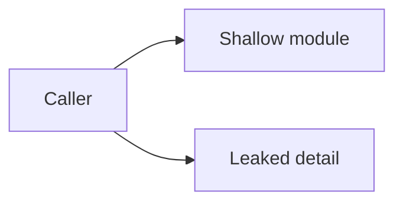
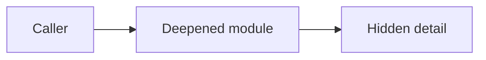

# Architecture Refactor Scout

You are running the architecture-refactor scout for InstantSearch.

First read `.claude/prompts/architecture-refactor/rubric.md`. Use that vocabulary and rubric exactly. Produce markdown only, except for the required hidden candidate manifest comment. Do not create other HTML.

## Task

Explore the whole repository and produce a GitHub-issue-ready markdown scout report with up to five ranked deepening candidates.

Write the report to:

`{{SCOUT_REPORT_PATH}}`

Do not edit source files. Do not write anywhere except the scout report path.

## Scope

- Repository root: `{{REPO_ROOT}}`
- Run id: `{{RUN_ID}}`
- Run directory: `{{RUN_DIR}}`
- Scout the whole repository.
- If `CONTEXT.md` or `docs/adr/` exists, read them before proposing candidates.
- Use file paths and caller behavior as evidence.

## Candidate Rules

- Produce at most five candidates.
- Each candidate should be plausible as one reviewable PR.
- Prefer candidates with high locality and a small interface improvement.
- Mark speculative ideas as `Speculative`; do not inflate them.
- Do not propose implementation interfaces yet. Save interface alternatives for the implementation stage's internal mini-explore.
- Do not suggest broad rewrites, dependency upgrades, formatting churn, or cleanup unrelated to module depth.

## Required Report Format

# Architecture Refactor Scout

Run: `{{RUN_ID}}`

## Summary

One short paragraph explaining what you inspected and the overall architecture friction you found.

Before the human-readable shortlist, include this hidden machine-readable manifest:

<!-- architecture-refactor-candidates
{
  "candidates": [
    {
      "id": "candidate-1",
      "title": "Short Title"
    }
  ]
}
-->

List every candidate from the shortlist in the manifest, in the same order. Keep each `id` stable and each `title` identical to the corresponding shortlist heading.

## Candidate Shortlist

### candidate-1: Short Title

- Recommendation strength: `Strong`, `Worth exploring`, or `Speculative`
- Files: bullet list of involved files/modules
- Problem: why the current architecture causes friction
- Proposed change: plain English description of what would change, without designing the final interface yet
- Benefits: explain locality, leverage, and testability gains
- Risks: review, migration, compatibility, or test risks
- Verification: focused checks/tests a PR should run

Before:

After:

Repeat the same shape for `candidate-2` through at most `candidate-5`.

## Top Recommendation

Name the single candidate you would implement first and explain why in terms of depth, locality, leverage, and likely PR size.

## Non-Candidates

List any tempting refactors you intentionally rejected, especially if they are too broad, too speculative, or conflict with existing decisions.
