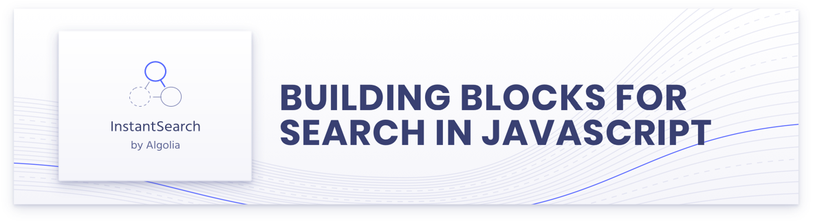

<p align="center">
  <a href="https://www.algolia.com/doc/guides/building-search-ui/what-is-instantsearch/js/">
    
  </a>
</p>

Hello and welcome to the contributing guide for InstantSearch. Thanks for considering participating in our project 🙇

If this guide does not contain what you are looking for and thus prevents you from contributing, don't hesitate to leave a message on the [community forum](https://discourse.algolia.com/) or to [open an issue](https://github.com/algolia/instantsearch/issues).

<!-- START doctoc generated TOC please keep comment here to allow auto update -->
<!-- DON'T EDIT THIS SECTION, INSTEAD RE-RUN doctoc TO UPDATE -->

- [Reporting an issue](#reporting-an-issue)
- [The code contribution process](#the-code-contribution-process)
- [Commit conventions](#commit-conventions)
- [Branch organization](#branch-organization)
- [Requirements](#requirements)
- [Launch the dev environment](#launch-the-dev-environment)
- [Folders of the project](#folders-of-the-project)
- [Importing existing projects](#importing-existing-projects)
- [Tests](#tests)
  - [How to write a test](#how-to-write-a-test)
  - [Testing a widget](#testing-a-widget)
  - [Running tests](#running-tests)
  - [Type checks](#type-checks)
- [Linting](#linting)
- [Release](#release)
  - [Main version](#main-version)
  - [Maintenance versions](#maintenance-versions)

<!-- END doctoc generated TOC please keep comment here to allow auto update -->

## Reporting an issue

Opening an issue is very effective way to contribute because many users might also be impacted. We'll make sure to fix it quickly if it's technically feasible and doesn't have important side effects for other users.

Before reporting an issue, first check that there is not an already open issue for the same topic using the [issues page](https://github.com/algolia/instantsearch/issues). Don't hesitate to thumb up an issue that corresponds to the problem you have.

Another element that will help us go faster at solving the issue is to provide a reproducible test case. We often recommend to use one of the following CodeSandbox templates:

<table>
  <tr>
    <td><a href="https://codesandbox.io/s/github/algolia/instantsearch/tree/templates/instantsearch.js" target="_blank">InstantSearch.js</a></td>
    <td><a href="https://codesandbox.io/s/github/algolia/instantsearch/tree/templates/react-instantsearch" target="_blank">React InstantSearch</a></td>
    <td><a href="https://codesandbox.io/s/github/algolia/instantsearch/tree/templates/vue-instantsearch" target="_blank">Vue InstantSearch</a></td>
  </tr>
</table>

## The code contribution process

InstantSearch is developed in TypeScript.

For any code contribution, you need to:

- Fork and clone the project
- Create a new branch for what you want to solve (fix/_issue-number_, feat/_name-of-the-feature_)
- Make your changes
- Open a pull request

Depending on what you're working on, you might consider different [base branches](#branch-organization).

Then:

- Peer review of the pull request (by at least one of the core contributors)
- Automatic checks ([tests](#tests), [commits](#commit-conventions), [linters](#linting))
- When everything is green, your contribution is merged 🚀

After you create a pull request, a bot will comment with a link to a development version of the website.

You will find a playground for the widgets, for example: <https://deploy-preview-6609--instantsearchjs.netlify.app/stories/js/>

## Commit conventions

This project follows the [conventional changelog](https://conventionalcommits.org/) approach. This means that all commit messages should be formatted using the following scheme:

```
type(scope): description
```

In most cases, we use the following types:

- `fix`: for any resolution of an issue (identified or not)
- `feat`: for any new feature
- `refactor`: for any code change that neither adds a feature nor fixes an issue
- `docs`: for any documentation change or addition
- `chore`: for anything that is not related to the library itself (doc, tooling)

Even though the scope is optional, we try to fill it in as it helps us better understand the impact of a change. We either use the name of the widget/connector/component impacted or we use impact topic (e.g. `docs`, `tooling`, `deps`, `ci`).

Finally, if your work is based on an issue on GitHub, please add in the body of the commit message "fix #1234" if it solves the issue #1234 (read "[Closing issues using keywords](https://help.github.com/en/articles/closing-issues-using-keywords)").

Some examples of valid commit messages (used as first lines):

> - fix(searchbox): increase magnifying glass size
> - chore(deps): update dependency rollup-plugin-babel to v3.0.7
> - fix(connectRefinementList): set default value for limit
> - chore: reword contributions guides

## Branch organization

The project is based on the classic GitHub flow:

- `master` for the current version being worked on – Pull requests for bugs and feature related to the current major version should be created against this branch
- `vX` for each major version (`X` being a number) – Pull requests for critical bug fixes should be created against this branch

Most of the time, your pull requests should target the `master` branch.

_Note that no new features will be developed or backported for the `vX` branches._

## Requirements

To run this project, you will need:

- Node.js ≥ 20 (current stable version) – [nvm](https://github.com/creationix/nvm#install-script) is recommended
- [Yarn](https://yarnpkg.com)

## Launch the dev environment

Each flavor has a **getting-started** example which can be used for development purposes.

First, build the libraries and watch changes:

```sh
yarn watch:es
```

Then start the server of the relevant example:

```sh
yarn --cwd examples/js/getting-started start
```

Finally, go to the URL displayed on the terminal (generally http://localhost:3000) to view the example in a browser.

We also use [Storybook](https://github.com/storybooks/storybook) to create stories for widgets:

```sh
yarn
cd packages/instantsearch.js
yarn storybook
```

Go to <http://localhost:6006> for the widget playground.

## Folders of the project

Here are the main files and folders of the project.

```
▸ examples/                            << Examples, grouped per flavor
▸ packages/                            << Packages of the project
  ▸ instantsearch-ui-components/         << Shared UI components library across all flavors
  ▸ react-instantsearch/                 << Bundled React InstantSearch library
  ▸ react-instantsearch-core/            << Runtime-independent React InstantSearch version
  ▸ instantsearch.js/                    << The InstantSearch.js library
  ▸ vue-instantsearch/                   << Bundled Vue InstantSearch library
▸ tests/                               << The test utilites
  ▸ mocks/                             << Fake versions of the API, for testing
  ▸ utils/                             << Global utilities for the tests
▸ website/                             << The generated website
▸ scripts/                             << The scripts for maintaining the project
  CHANGELOG.md                         << The autogenerated changelog (based on commits)
  CONTRIBUTING.md                      << this file
  package.json                         << The definition of the project
  README.md                            << The introduction of the project
```

## Importing existing projects

This monorepo has as goal to be used for all InstantSearch flavors and tools. To do so, we need to import existing projects into this repository. The process is as follows:

1. clone your project into a new clean folder (/tmp/myproject)
2. install [`git-filter-repo`](https://github.com/newren/git-filter-repo)
3. run `git filter-repo --to-subdirectory-filter packages/myproject`
4. add your temporary clone as a remote in the instantsearch repository: `git remote add myproject /tmp/myproject`
5. fetch the remote: `git fetch myproject`
6. check out to a new branch: `git checkout -b feat/import-myproject`
7. merge the remote into the monorepo: `git merge --allow-unrelated-histories myproject/mybranch`
8. replace commit messages which refer to issues/PRs with #xxx by also referencing the original repo: `git filter-branch --msg-filter 'sed -E "s/(#[[:digit:]]+)/algolia\/myproject\1/"' master..feat/import-myproject`
9. make any changes necessary to make the project work in the monorepo and commit those
10. make a pull request and _merge using rebase or merge_ (if you merge using squash the history will be lost)
11. manually tag and push the latest release commit from the imported project to let shipjs know which version to take into account during the next release process

## Tests

The general philosophy of testing in InstantSearch follows [Testing Library's guiding principles](https://testing-library.com/docs/guiding-principles):

> The more your tests resemble the way your software is used, the more confidence they can give you.

We rely on [Jest](https://jestjs.io/) for unit tests on all flavors of InstantSearch. In addition, [React Testing Library](https://testing-library.com/docs/react-testing-library/intro/) is used to test interactions in React InstantSearch.

### How to write a test

Your tests should follow the [Arrange-Act-Assert](http://wiki.c2.com/?ArrangeActAssert) pattern.

#### Arrange

Set up the conditions for your test, such as creating a mocked search client, initializing the widget, and starting InstantSearch. **It should look like the code an InstantSearch user would write**, so refrain from manipulating internals. If you need mocks or spies, keep them minimal so the test case remains readable.

#### Act

Execute the code you're testing. If you're testing the initial render, this part would only contain the instantiation of the widget and the starting of InstantSearch. If you're testing what happens when an end user clicks a button, this part would contain the click on the button element as well.

When querying elements, do it in a way that mindfully enforces the contract you're defining. For widgets, since class names are part of the public API, it's recommended to query elements by class name.

In many like a user would by reflecting the experience of visual/mouse users as well as those that use assistive technology.

**❌ Incorrect**

```js
// There might be other buttons, and this doesn't confirm that the right button
// triggered the right action.
const button = getByRole('button');

// Unless the element is impossible to query without a test ID, avoid them.
const button = getByTestId('show-more-button');
```

**✅ Correct**

```js
// This enforces the contract by identifying the button with an attribute that
// the user has access to and could rely on for other things.
const button = document.querySelector('.ais-RefinementList-showMore');
```

> ℹ️ Learn more about [available queries](https://testing-library.com/docs/queries/about#types-of-queries) and [priority](https://testing-library.com/docs/queries/about#priority).

When you're testing user interactions, make sure to simulate full interactions and not manually dispatch events you thing should fire. To do so, use [`user-event`](https://testing-library.com/docs/user-event/intro/).

**❌ Incorrect**

```js
// Use `userEvent` over `fireEvent` unless you have a legit case for it.
fireEvent.click(button);

// Don't manually dispatch with lower-level APIs or create custom-made events,
// the browser might do other things you don't see or know about.
fireEvent(button, new MouseEvent('click', { bubbles: true, cancelable: true }));
button.dispatchEvent(
  new MouseEvent('click', { bubbles: true, cancelable: true })
);
```

**✅ Correct**

```js
// This focuses on the interaction itself and relies on `userEvent` to behave
// like the browser would.
userEvent.click(button);
```

> ℹ️ Learn more about [firing events](https://testing-library.com/docs/dom-testing-library/api-events/).

#### Assert

Verify that the code you're testing behaves as expected.

If you're testing the initial render, you can use [inline Jest snapshots](https://jestjs.io/docs/snapshot-testing) to assert what HTML gets rendered on the page. Don't use external snapshots.

**❌ Incorrect**

```js
// Don't use external snapshots as they're harder to manage and makes you switch
// between file to understand the test.
expect(container).toMatchSnapshot();
```

**✅ Correct**

```js
// Use inline snapshots to encapsulate the entire test in a single place.
expect(container).toMatchInlineSnapshot(`
  <div>
    <!-- … -->
  </div>
`);
```

Don't overuse snapshots, as they make tests files longer and are harder to review. Try limiting yourself to a single snapshot for initial render, and if you're testing DOM changes after an interaction, only test this part instead of using another snapshot.

**❌ Incorrect**

```js
const showMoreButton = container.querySelector('.ais-RefinementList-showMore');

userEvent.click(showMoreButton);

// Don't use a snapshot to assert the whole HTML structure after an interaction
// as they're harder to read and don't help focusing on what has changed.
expect(container).toMatchInlineSnapshot(`
  <div>
    <!-- … -->
  </div>
`);
```

```js
const showMoreButton = container.querySelector('.ais-RefinementList-showMore');
const listItems = container.querySelectorAll('.ais-RefinementList-item');

userEvent.click(showMoreButton);

await waitFor(() => {
  // Test the elements that did change, making it clear what the consequences of
  // the interaction are.
  expect(showMoreButton).toHaveTextContent('Show less');
  expect(listItems).toHaveLength(20);
});
```

> **Note** Sometimes, a second (focused) snapshot is clearer and shorter than a series of isolated assertions. Use your judgment to determine what will make the test the tersest and easiest to understand.

### Testing a widget

Widgets in InstantSearch are building blocks that have a predefined behavior and render output. Widgets usually have options to alter their behavior; options can be passed to widgets via attributes.

When testing a widget, you should focus on **user interactions, rendering, and possibly side-effects**.

For example, you should test:

- The rendering of a widget after passing all possible props.
- The rendering of a widget or its side-effects (e.g., URL updates when used with routing) after interacting with it.

Sometimes, you might also want to write performance tests to assess that a widget didn't render more than expected, or didn't unnecessarily call the search client.

**Some tests might be common between your widget and its connector.** This is fine because they're two different APIs for the user, and the fact that a widget uses a connector under the hood is an implementation detail.

However, refrain from testing components that aren't publicly available. For example, you don't need to test the UI components that the widgets use for rendering, because they're not exposed to the user. You'd end up writing twice the same tests for no gain.

This guideline doesn't apply for internal utility functions used widely across the project, as testing them can help with codebase discovery and narrowing down isolated issues.

#### Common test suites

Across flavors, InstantSearch widgets should behave mostly the same (aside from legacy disparities we're still ironing out in major versions). For this reason, **we aim at writing widget tests once by using common test suites.**

Common test suites are defined in `tests/common`. They're agnostic test suites that assert behaviors that should be the same across flavors.

To learn more, please read the [dedicated guidelines on common tests](./tests/common/README.md).

### Running tests

Our unit tests are written with [Jest](https://facebook.github.io/jest/).

To run all the tests once:

```sh
yarn test
```

To run the test continuously based on what you changed (useful when developing or debugging):

```sh
yarn test --watch
```

End-to-end tests are defined in [tests/e2e](./tests/e2e/README.md).

To run them locally:

```sh
yarn test:e2e:local
```

To run them on Sauce Labs:

```sh
yarn test:e2e:saucelabs
```

> **Note** Make sure to set up Sauce Labs credentials with the `SAUCE_USERNAME` and `SAUCE_ACCESS_KEY` environment variables.

For more info, including how to write end-to-end tests, check the `tests/e2e` [CONTRIBUTING](./tests/e2e/CONTRIBUTING.md) and [README](./tests/e2e/README.md) files.

### Type checks

Type checks ensure code is correctly typed both for code quality and TypeScript compatibility.

To ensure typing is correct in the latest version of InstantSearch.js, you can run the following command:

```sh
yarn type-check
```

Since we still support `algoliasearch@3`, you should also type check against v3.x.

```sh
./scripts/legacy/downgrade-algoliasearch-dependency.js
yarn type-check:v3
```

## Linting

Linters are static checkers for code. They help us maintain a consistent code base. They are used for JavaScript and TypeScript files.

If your editor support them, then you will see the errors directly there. You can also run them using your command line:

```sh
yarn lint
```

JavaScript and TypeScript files are validated using a combination of [Prettier](https://github.com/prettier/prettier) (strict syntax form) and [ESLint](https://github.com/eslint/eslint) rules (for common mistakes and patterns).

## Release

### Main version

To release a stable version, go on `master` (`git checkout master`) and use:

```sh
yarn run release
```

It will create a pull request for the next release. When it's reviewed, approved and merged, then CircleCI will automatically publish it to npm.

### Maintenance versions

For the maintenance versions, go to a previous version branch (e.g., `git checkout v3`) and use:

```sh
npm run release:maintenance
```

_Make sure to use `npm run` instead of `yarn run` to avoid issues._

#### `next` version

`next` version release is available on the `next` branch. It is used to release the next major version in beta.

```sh
git checkout next
yarn run release
```

The script will ask you a question about the next version. If it's wrong, you can say "No" and specify the version (e.g. "7.0.0-beta.0"). Then, it will open a pull request for that release. When the pull request is merged, CircleCI will publish it to npm with a `--tag beta` argument.
