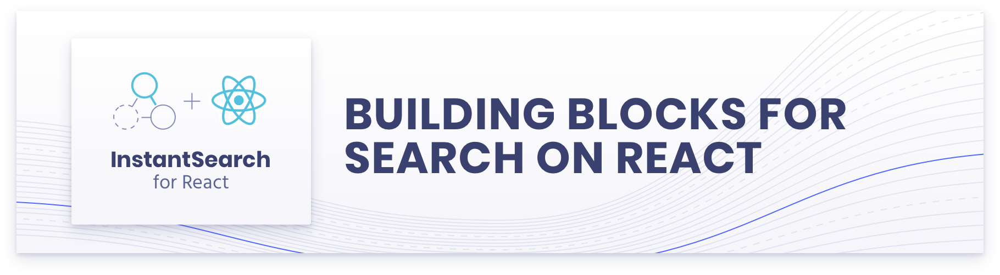
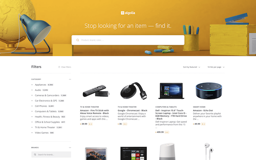
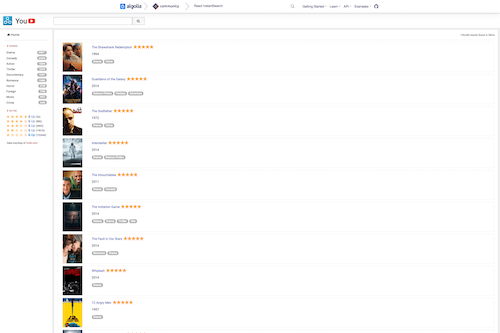
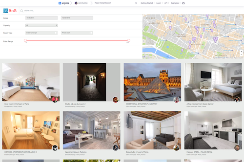

<p align="center">
  <a href="https://www.algolia.com/doc/guides/building-search-ui/what-is-instantsearch/react/">
    
  </a>

  <p align="center">
    React InstantSearch is a library for building blazing fast search-as-you-type search UIs with <a href="https://www.algolia.com">Algolia</a>.
  </p>
</p>

---

[![Version][version-svg]][package-url] [![Build Status][ci-svg]][ci-url] [![License][license-image]][license-url] [![Downloads][downloads-image]][downloads-url]

React InstantSearch is a React library that lets you create an instant-search result experience using [Algolia][algolia-website]’s search API. It is part of the InstantSearch family:

**React InstantSearch** | [InstantSearch.js][instantsearch.js-github] | [Angular InstantSearch][instantsearch-angular-github] | [Vue InstantSearch][instantsearch-vue-github] | [InstantSearch Android][instantsearch-android-github] | [InstantSearch iOS][instantsearch-ios-github]

## Why

You should be using React InstantSearch if you want to:

* Design search experiences with best practices
* Customize your components at will
* Follow React principles

## Installation

React InstantSearch is available on the npm registry. It relies on [`algoliasearch`](https://github.com/algolia/algoliasearch-client-javascript) to communicate with Algolia APIs.

```sh
yarn add react-instantsearch-dom algoliasearch
# or
npm install react-instantsearch-dom algoliasearch
```

## Getting started

Using React InstantSearch is as simple as adding these components to your app:

```javascript
import React from 'react';
import ReactDOM from 'react-dom';
import algoliasearch from 'algoliasearch/lite';
import { InstantSearch, SearchBox, Hits } from 'react-instantsearch-dom';

const searchClient = algoliasearch(
  'latency',
  '6be0576ff61c053d5f9a3225e2a90f76'
);

const App = () => (
  <InstantSearch
    indexName="bestbuy"
    searchClient={searchClient}
  >
    <SearchBox />
    <Hits />
  </InstantSearch>
);
```

<p align="center">
  <a href="https://codesandbox.io/s/github/algolia/doc-code-samples/tree/master/React InstantSearch/getting-started" title="Edit on CodeSandbox">
    
  </a>
</p>

To learn more about the library, follow the [getting started guide][doc-getting-started].

## Documentation

The documentation is available on [algolia.com/doc][doc].

## Demos

| E-commerce                                                                                                                                                                             | Media                                                                                                                                                                   | Travel                                                                                                                                                                        |
| -------------------------------------------------------------------------------------------------------------------------------------------------------------------------------------- | ----------------------------------------------------------------------------------------------------------------------------------------------------------------------- | ----------------------------------------------------------------------------------------------------------------------------------------------------------------------------- |
| <a href="https://react-instantsearch.netlify.com/examples/e-commerce/"></a> | <a href="https://react-instantsearch.netlify.com/examples/media/"></a> | <a href="https://react-instantsearch.netlify.com/examples/tourism/"></a> |

See more examples [on the website][doc-demos].

## Playground

You can get to know React InstantSearch on [this playground][doc-playground].

Start by [adding components][doc-getting-started] and tweaking the display. Once you get more familiar with the library, you can learn more advanced concepts in [our guides][doc-guides].

## Troubleshooting

Encountering an issue? Before reaching out to support, we recommend heading to our [FAQ](https://www.algolia.com/doc/guides/building-search-ui/troubleshooting/faq/react/) where you will find answers for the most common issues and gotchas with the library.

## Contributing

We welcome all contributors, from casual to regular. You are only one command away to start the developer environment, [read our CONTRIBUTING guide](CONTRIBUTING.md).

## License

React InstantSearch is [MIT licensed](LICENSE).

<!-- Links -->

[doc]: https://www.algolia.com/doc/guides/building-search-ui/what-is-instantsearch/react/
[doc-getting-started]: https://www.algolia.com/doc/guides/building-search-ui/getting-started/react/
[doc-guides]: https://www.algolia.com/doc/guides/building-search-ui/widgets/customize-an-existing-widget/react/
[doc-demos]: https://www.algolia.com/doc/guides/building-search-ui/resources/demos/react/
[doc-playground]: https://codesandbox.io/s/github/algolia/create-instantsearch-app/tree/templates/react-instantsearch
[algolia-website]: https://www.algolia.com/
[instantsearch.js-github]: https://github.com/algolia/instantsearch.js
[instantsearch-android-github]: https://github.com/algolia/instantsearch-android
[instantsearch-ios-github]: https://github.com/algolia/instantsearch-ios
[instantsearch-vue-github]: https://github.com/algolia/vue-instantsearch
[instantsearch-angular-github]: https://github.com/algolia/angular-instantsearch
[ci-svg]: https://circleci.com/gh/algolia/react-instantsearch.svg?style=svg
[ci-url]: https://circleci.com/gh/algolia/react-instantsearch
[license-image]: http://img.shields.io/badge/license-MIT-green.svg?style=flat-square
[license-url]: LICENSE
[downloads-image]: https://img.shields.io/npm/dm/react-instantsearch.svg?style=flat-square
[downloads-url]: http://npm-stat.com/charts.html?package=react-instantsearch
[version-svg]: https://img.shields.io/npm/v/react-instantsearch.svg?style=flat-square
[package-url]: https://yarnpkg.com/en/package/react-instantsearch
