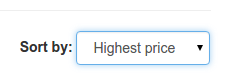
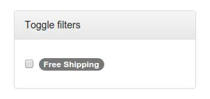

# instantsearch.js

Instant search for everyone, even for your cat 😸.

API is unstable. We welcome any idea.

<!-- START doctoc generated TOC please keep comment here to allow auto update -->
<!-- DON'T EDIT THIS SECTION, INSTEAD RE-RUN doctoc TO UPDATE -->


- [Usage](#usage)
- [Widget API](#widget-api)
- [Dev](#dev)
- [Test](#test)
- [Available widgets](#available-widgets)
  - [searchBox](#searchbox)
  - [stats](#stats)
  - [pagination](#pagination)
  - [hits](#hits)
  - [toggle](#toggle)
  - [refinementList](#refinementlist)
  - [menu](#menu)

<!-- END doctoc generated TOC please keep comment here to allow auto update -->

## Usage

```js
var instantsearch = require('instantsearch.js');
var search = instantsearch(appId, apiKey, indexName);

// add a widget
search.addWidget(
  instantsearch.widgets.searchBox({
    container: '#search-box',
    placeholder: 'Search for libraries in France...'
  })
);

// start
search.start();
```

## Widget API

```js
function mySuperWidget(opts) {

  return {
    getConfiguration: function(searchParameters) {
      return {
        // helper params
      }
    },
    init: function(initialState, helper) {
      // helper: see http://algolia.github.io/algoliasearch-helper-js/docs/
      // called before first `helper.on('result');`
    },
    render: function(results, state, helper) {
      // content: see http://algolia.github.io/algoliasearch-helper-js/docs/SearchResults.html
      // helper: see http://algolia.github.io/algoliasearch-helper-js/docs/
      // called at each `helper.on('result')`
    }
  }
}

search.addWidget(mySuperWidget());
```

## Dev

Here is the development workflow:

```sh
npm run dev
# open http://localhost:8080
# make changes in your widgets, or in example/app.js
```

## Test

```sh
npm test # test and lint
npm run test:watch # developer mode, test only
npm run test:coverage
```

## Available widgets

### searchBox

```html
<div id="search-box"></div>
```

```js
search.addWidget(
  instantsearch.widgets.searchBox({
    container: '#search-box',
    placeholder: 'Search for products',
    // cssClass
  })
);
```

### stats

```html
<div id="stats"></div>
```

```javascript
search.addWidget(
  instantsearch.widgets.stats({
    container: '#stats',
    template: // mustache string or function(stats) with the following keys
              // nbHits: number,
              // hasNoResults: boolean
              // hasOneResult: boolean
              // hasManyResults: boolean
              // processingTimeMS: number
  })
);
```

### indexSelector

This widget will let you change the current index being targeted. This is
especially useful for changing the current sort order. If you need your results
ordered following a special rule (like price ascending or price descending),
you'll need several indices. This widget lets you easily change it.



```html
<div id="index-selector"></div>
```

```javascript
search.addWidget(
  instantsearch.widgets.indexSelector({
    container: '#index-selector',
    indices: [
      {name: 'instant_search', label: 'Most relevant'},
      {name: 'instant_search_price_asc', label: 'Lowest price'},
      {name: 'instant_search_price_desc', label: 'Highest price'}
    ],
    cssClass: 'form-control'
  })
);
```

```javascript
/**
 * Instantiate a dropdown element to choose the current targeted index
 * @param  {String|DOMElement} options.container Valid CSS Selector as a string or DOMElement
 * @param  {Array} options.indices Array of objects defining the different indices to choose from. Each object must contain a `name` and `label` key.
 * @param  {String} [options.cssClass] Class name(s) to be added to the generated select element
 * @return {Object}
 */
```

### pagination

```html
<div id="pagination"></div>
```

```js
search.addWidget(
  instantsearch.widgets.pagination({
    container: '#pagination',
    // cssClass, // add cssClasses to the main wrapper
    // padding: 3, // number of page numbers to show before/after current
    // showFirstLast: true, // show or hide first and last links
    // maxPages, // automatically computed based on the result set
    // labels: {
    //   prev: '‹', // &lsaquo;
    //   next: '›', // &rsaquo;
    //   first: '«', // &laquo;
    //   last: '»' // &raquo;
    // }
  })
);
```

### hits

```html
<div id="hits"></div>
```

```js
search.addWidget(
  instantsearch.widgets.hits({
    container: '#hits',
    templates: {
      empty, // string (mustache format) or function(hit) return string 
      hit // string (mustache format) or function(hit) return string
    },
    hitsPerPage: 20,
    // cssClass
  })
);
```

### toggle

This widget is used to add filtering of results on a boolean value. Let's say
you want to only display elements that are eligible to free shipping. You'll
just have to instantiate this widget with a `facetName` of `free_shipping` (with
`free_shipping` being a boolean attribute in your records.

When toggling on this widget, only hits with Free Shipping will be displayed.
When switching it off, all items will be displayed.

Note that we are not toggling from `true` to `false` here, but from `true` to
`undefined`.



```html
<div id="free_shipping"></div>
```

```javascript
search.addWidget(
  instantsearch.widgets.toggle({
    container: '#free_shipping',
    facetName: 'free_shipping',
    label: 'Free Shipping',
    template: '<label><input type="checkbox" {{#isRefined}}checked{{/isRefined}} />{{label}}</label>'
  })
);
```

```javascript
/**
 * Instantiate the toggling of a boolean facet filter on and off.
 * Note that it will not toggle between `true` and `false, but between `true`
 * and `undefined`.
 * @param  {String|DOMElement} options.container Valid CSS Selector as a string or DOMElement
 * @param  {String} options.facetName Name of the attribute for faceting (eg. "free_shipping")
 * @param  {String} options.label Human-readable name of the filter (eg. "Free Shipping")
 * @param  {String|Function} [options.template] Item template, provided with `label` and `isRefined`
 * @return {Object}
 */
```


### refinementList

#### API

```js
/**
 * Instantiate a list of refinements based on a facet
 * @param  {String|DOMElement} options.container Valid CSS Selector as a string or DOMElement
 * @param  {String} options.facetName Name of the attribute for faceting
 * @param  {String} options.operator How to apply refinements. Possible values: `or`, `and`
 * @param  {String[]} [options.sortBy=['count:desc']] How to sort refinements. Possible values: `count|isRefined|name:asc|desc`
 * @param  {String} [options.limit=100] How much facet values to get.
 * @param  {String|String[]} [options.rootClass=null] CSS class(es) for the root `<ul>` element
 * @param  {String|String[]} [options.itemClass=null] CSS class(es) for the item `<li>` element
 * @param  {String|Function} [options.template] Item template, provided with `name`, `count`, `isRefined`
 * @param  {String|Function} [options.singleRefine=true] Are multiple refinements allowed or only one at the same time. You can use this
 *                                                       to build radio based refinement lists for example.
 * @return {Object}
 */
```


#### Usage

```html
<div id="brands"></div>
```

```js
search.addWidget(
  instantsearch.widgets.refinementList({
    container: '#brands', 
    facetName: 'brands',
    operator: 'or'
  })
);
```

### menu

#### API

```js
/**
 * Create a menu out of a facet
 * @param  {String|DOMElement} options.container Valid CSS Selector as a string or DOMElement
 * @param  {String} options.facetName Name of the attribute for faceting
 * @param  {String[]} [options.sortBy=['count:desc']] How to sort refinements. Possible values: `count|isRefined|name:asc|desc`
 * @param  {String} [options.limit=100] How much facet values to get.
 * @param  {String|String[]} [options.rootClass=null] CSS class(es) for the root `<ul>` element
 * @param  {String|String[]} [options.itemClass=null] CSS class(es) for the item `<li>` element
 * @param  {String|Function} [options.template] Item template, provided with `name`, `count`, `isRefined`
 * @return {Object}
 */
```


#### Usage

```html
<div id="categories"></div>
```

```js
search.addWidget(
  instantsearch.widgets.menu({
    container: '#categories', 
    facetName: 'categories'
  })
);
```
