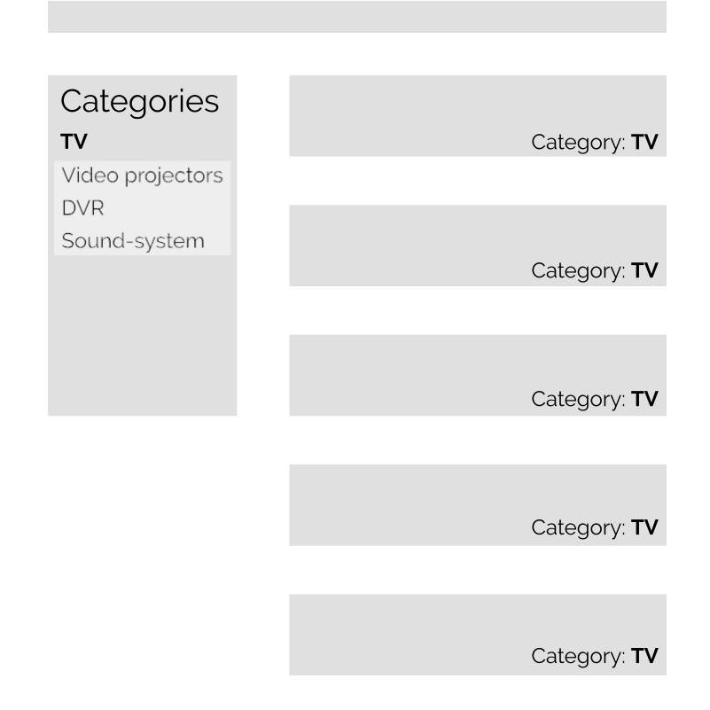

## High level concepts

### Search flow

The search flow is the cycle between the UI and the search engine. When a user updates a parameter in the UI, a new search is triggered, and new results appear. Not only these results are updated, but also all the filters available should be too.


### The source of truth of the UI

The Helper stores and keeps track of the successive filters applied in your search UI. It is the source of truth for your search parameters. This makes all the UI components that you use independent from each other while still being able to trigger the search. For example, the text search input will only set the `query` whereas the category list will only deal with facets. But both will trigger the search with the parameters of the other.


Changing the parameters of the search with the Helper does not trigger the search. Instead the changes are stored until the `search` method is called. Taking the first schema for reference, the updates look like that:


## Managed parameters

Most of the parameters on the Algolia Rest API are simple, strings (eg. `query` which is the fulltext input of the search), numbers (eg. `hitsPerPage` which configures the numbers of records returned per response). But some are trickier and delivers great expressivity. For example, you can specify ranges of values for numerical attributes. You can also define facets on string based attributes, which let you filter on specific values.

Managing those kind of parameters is hard in a UI context because you need:

- to know the current state
- to manipulate specifically the part, the UI component is responsible for

And of course, you don't want to manipulate a deep structure of arrays and objects by hand.

That's why the filtering APIs are presented as methods on the Helper instance. These methods let you edit those filters rather than input the strings themselves. We still keep the ability to input the string parameters, but this interface (that we call **raw**) is exclusive with the higher level one (that we call **managed**)

This layer on top of the Algolia API even lets us create features that don't exist in the Rest API. We have created some features that rely on multiple queries based on the pattern we found over time.

On and on, the overall idea of those managed API's is to make the usage of Algolia filters as easy as possible. Some are mainly adaptation of the API, like Numerical, Facets and Excluding Facets, but others are more complex and bring new features.

### Numerical filters

The numerical filters brings the ability to manage constraints over numerical attributes. For each attribute, you can combine sets of constraints. Those filters for any numerical data, but also with dates if converted to timestamps in the records.

### Conjunctive and excluding facets

With facets, you can filter in or out the results based on the values that an attribute can take. Let's take an example:

```js
[
  { name: 'Paris', type: ['city', 'capital'] },
  { name: 'Marseille', type: ['city'] },
  { name: 'London', type: ['city', 'capital'] },
];
```

These three records represent cities. If we facet `type`, Algolia will return the list of available values (city, capital) and will let us filter using those values.

With conjunctive facets you express that you want two or more values combined with AND. With excluding facets, you express that you **DO NOT** want values.

These facets need to be declared so that the values can be retrieved and then filtered through the UI ([see the configuration](reference.html#conjunctive-facets)).

### Disjunctive faceting

With Algolia you can retrieve for each faceted attribute the most used values in your results. This means that if a value is not in your results, you won't be aware of its existence. This can be inconvenient when you want your user to be able to select many values and combine them with an OR condition, because once you've selected a value the other that could be chosen won't be returned by Algolia.

Let's take an example. Imagine your dataset contains high-tech products. And those products are categorized. Amongst those products you have TVs and video projectors, each in their own category. By default, if you select TV then only the TV will be returned and therefore the facet values for the category will only be TV.


The purpose of the disjunctive facets is to be able to search further than a single facet filter. To do that, the helper implements a second request that will be specifically tailored to retrieve the other facet values possible for a specific faceted attribute.

Going back to our example, the first request retrieves the results and a second one will retrieve the values for the category attribute. When the results come back from Algolia the two requests will be merged and a single list of values will be created.



These facets need to be declared so that the values can be retrieved and then filtered through the UI ([see the configuration](reference.html#disjunctive-facets)).

### Hierarchical faceting

The hierarchical facets extends the concepts used in the disjunctive faceting in order to be able to organize the values in a tree like fashion.

When using the same high-tech e-shop example (see the previous paragraph about [disjunctive faceting](#disjunctive-faceting)), we can imagine that TV and video projectors are organized in a higher category called video hardware.

The structure inside the record should contain all the variations per level. For a product in the TV category, the record will have a `lvl1` attribute that will contain `video hardware` and a `lvl2` that will contain `video hardware > TV`. With the hierarchical feature, you can facet values per level and you will be provided the correct hierarchy of facet values.

```markdown
- Video hardware
  - TV
  - DVR
- Kitchen
```

Since this is a feature built on top of the Algolia API, we expect the dataset to follow a hierarchical notation ([see the configuration](reference.html#hierarchical-facets)).

## Special capabilities

What makes the special sauce of the Helper is a conjunction of patterns and smart tricks to help you make the best search UI:

- chainable API
- event-based
- immutable model
- smart page handling

### Event based

In UIs, it's very likely that you will have more than a single point where you want to update and trigger a new search. On the other hand, it's very unlikely that where you want to update the UI will be at the same place.

For those reasons, the Helper implements events. There are four kinds of events on the Helper :

- `change`: triggered when a parameter is set or updated
- `search`: triggered when the search is sent to Algolia
- `result`: triggered when the results are retrieved Algolia
- `error`: triggered when Algolia sends back an error


### Chainability

All the write operations of the Helper are chainable. This means that all those methods will return the Helper object. This leads to a more concise way to express the operations done on the helper.

For example, setting the query and triggering the search looks like that, thanks to the chainability:

```js
helper.setQuery('tv').search();
```

### Immutability of the search parameters

An immutable object is an object which values cannot be modified after it is created. For example, in Javascript strings are immutable. This means that you can't directly change the value and each write operation will return a new object.

Inside the Helper, we use an immutable object to store the search parameters. The Helper write and read methods are proxies to the search parameters object.

For example, when the setQuery method is called it is forwarded to the search parameters. This will create a new instance of the search parameters, which will replace the `state` property of the helper, and finally the helper will emit the `change` event.

The immutability of the search parameters has some interesting usage:

- each search parameter is stored when the request is sent to Algolia, and provided back when the `result` event is fired.
- if we want to create urls with different parameters, we can reuse the search parameters object and its api to create new states that we can serialize.


### Derivations of the helper: multi-queries

Derivation is the ability to create virtual helpers to be able to generate requests based on the main JS Helper instance. For example, with this feature, you can:

- query two indices at the same time.
- search in the same index with different parameters.

The virtual helpers are created by calling the [derive](reference.html#AlgoliaSearchHelper#derive) method with a _derivation function_. The derivation function is used when `search` is called. For each derivated Helper, it will derive a new state from the main. All of those requests will be sent together along the main helper request. When Algolia answers come back, the results will be dispatched to each helper via events (`error` or `result`).

Here is a schematic view of the process happening during a search with derivated helpers:


This schema only present a single derivated helper but there can be more than one.

### Smart page behaviour

In a search engine, the most relevant results are always on the first page. And each new set of parameters sent to Algolia will return a new set of results. This means that each time the parameters are changed, the most relevant will be on the very first page. Also, each new set of parameters might change the number of available pages. Therefore, when the parameters are changed the page should be set to 0. This would lead to writing such code for each kind of settings to be set:

```js
// When we set the query
helper.setQuery(query).setPage(0).search();

// When we change a tag filter
helper.toggleTag(tag).setPage(0).search();
```

To avoid this kind of repetition, all the write methods on the helper will set the page to 0 with the exception of `setPage`. This is not the case for write methods on the immutable search parameters.

## Final words and where to go next

Congratulations for reading our high level presentation of the Helper. We hope that you have now a better understanding of what makes the Helper very useful when building instantsearch UI's.

If you haven't already, we suggest that you have a look at the [getting started](gettingstarted.html) to quickly start your very own search. If you are more interested in going in-depth the helper, be sure to check out:

- [The reference API](reference.html)
- [The examples](examples.html)

If after all, you think that you need a more comprehensive and widget-based library, we made [instantsearch.js](https://community.algolia.com/instantsearch.js/) for that.
