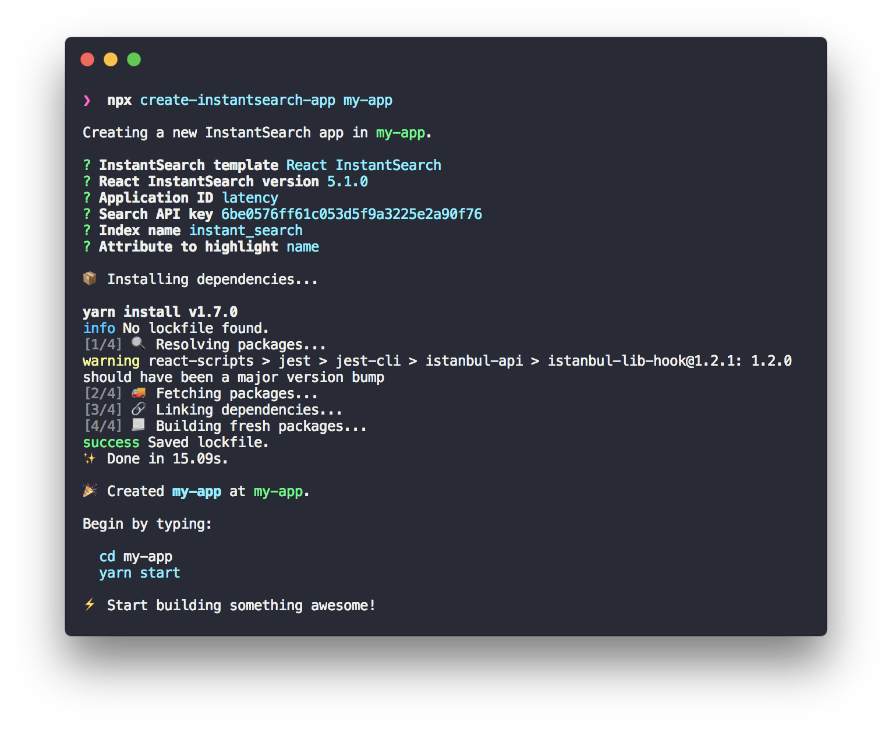

# Create InstantSearch App

> ⚡️ Build InstantSearch apps at the speed of thought.

[![Version][version-svg]][package-url] [![License][license-image]][license-url] [![Build Status][ci-svg]][ci-url]

`create-instantsearch-app` is a command line utility that helps you quick start your InstantSearch app using any [Algolia][algolia-website] InstantSearch flavor ([InstantSearch.js][instantsearchjs-github], [React InstantSearch][react-instantsearch-github], [Vue InstantSearch][vue-instantsearch-github], [InstantSearch iOS][instantsearch-ios-github] and [InstantSearch Android][instantsearch-android-github]).

<p align="center">
  
</p>

<details>
  <summary><strong>Contents</strong></summary>

<!-- START doctoc generated TOC please keep comment here to allow auto update -->
<!-- DON'T EDIT THIS SECTION, INSTEAD RE-RUN doctoc TO UPDATE -->

- [Get started](#get-started)
- [Usage](#usage)
- [API](#api)
- [Tutorials](#tutorials)
- [Previews](#previews)
- [Contributing](#contributing)
- [License](#license)

<!-- END doctoc generated TOC please keep comment here to allow auto update -->

</details>

## Get started

> The tool requires Node ≥ 8.

```
npx create-instantsearch-app my-app
cd my-app
npm start
```

> [`npx`](https://medium.com/@maybekatz/introducing-npx-an-npm-package-runner-55f7d4bd282b) is a tool introduced in `npm@5.2.0` that makes it possible to run CLI tools hosted on the npm registry.

---

Alternatively, you can use [Yarn](https://yarnpkg.com):

```
yarn create instantsearch-app my-app
cd my-app
yarn start
```

> **Important** Selecting 'Y' when being prompted to ‘Enable user events’ activates the [`insights`](https://www.algolia.com/doc/api-reference/widgets/instantsearch/js/#widget-param-insights) option for compatible templates, allowing Algolia to process your user Events. Events can unlock powerful features, enhancing your application's effectiveness and we encourage you to consider enabling this valuable functionality. Please review our [API reference](https://www.algolia.com/doc/api-reference/widgets/instantsearch/js/#widget-param-insights) for more details about Events collection and settings.

## Usage

This package comes with the module `createInstantSearchApp(path, options?)` and the command-line tool `create-instantsearch-app`.

```
$ create-instantsearch-app --help

  Usage: create-instantsearch-app <project-directory> [options]

  Options:

    -v, --version                                      output the version number
    --name <name>                                      The name of the application
    --app-id <appId>                                   The application ID
    --api-key <apiKey>                                 The Algolia search API key
    --index-name <indexName>                           The main index of your search
    --attributes-to-display <attributesToDisplay>      The attributes of your index to display
    --image-attribute <imageAttribute>                 The attribute of your index to use for image display
    --attributes-for-faceting <attributesForFaceting>  The attributes for faceting
    --template <template>                              The InstantSearch template to use
    --library-version <libraryVersion>                 The version of the library
    --config <config>                                  The configuration file to get the options from
    --no-installation                                  Ignore dependency installation
    --no-interactive                                   Do not ask any interactive questions
    -h, --help                                         output usage information
```

#### `--template`

Supported templates are:

- [`InstantSearch.js`][instantsearchjs-github]
- [`React InstantSearch`][react-instantsearch-github]
- [`React InstantSearch Native`][react-instantsearch-github]
- [`Vue InstantSearch`][vue-instantsearch-github]
- [`InstantSearch iOS`][instantsearch-ios-github]
- [`InstantSearch Android`][instantsearch-android-github]

```
create-instantsearch-app my-app --template "React InstantSearch"
```

You can also [create your own template](docs/custom-templates.md) and specify its path.

#### `--config`

The `config` flag is handy to automate app generations.

<h6 align="center">config.json</h6>

```json
{
  "name": "my-app",
  "template": "InstantSearch.js",
  "libraryVersion": "2.8.0",
  "appId": "MY_APP_ID",
  "apiKey": "MY_API_KEY",
  "indexName": "MY_INDEX_NAME",
  "searchPlaceholder": "Search",
  "attributesToDisplay": ["name", "description"],
  "imageAttribute": "image",
  "attributesForFaceting": ["brand", "location"],
  "enableInsights": true
}
```

Create the app based on this configuration:

```
create-instantsearch-app my-app --config config.json
```

## API

`create-instantsearch-app` is based on the module `createInstantSearchApp(path, options?)`. The same [camel cased](https://en.wikipedia.org/wiki/Camel_case) options as the CLI are available.

```javascript
const createInstantSearchApp = require('create-instantsearch-app');

const app = createInstantSearchApp('~/lab/my-app', {
  template: 'InstantSearch.js',
  libraryVersion: '2.0.0',
  attributesToDisplay: ['name', 'description'],
  imageAttribute: 'image',
  attributesForFaceting: ['keywords'],
  enableInsights: true,
});

app.create().then(() => console.log('App generated!'));
```

## Tutorials

- [Creating a custom template](docs/custom-templates.md)
- [Deploying an InstantSearch App](docs/deploy.md)

## Previews

You can use the web templates on CodeSandbox:

- [InstantSearch.js](https://codesandbox.io/s/github/algolia/instantsearch/tree/templates/instantsearch.js)
- [React InstantSearch](https://codesandbox.io/s/github/algolia/instantsearch/tree/templates/react-instantsearch)
- [Vue InstantSearch](https://codesandbox.io/s/github/algolia/instantsearch/tree/templates/vue-instantsearch)
- [Autocomplete.js](https://codesandbox.io/s/github/algolia/instantsearch/tree/templates/autocomplete.js)
- [JavaScript Client](https://codesandbox.io/s/github/algolia/instantsearch/tree/templates/javascript-client)
- [JavaScript Helper](https://codesandbox.io/s/github/algolia/instantsearch/tree/templates/javascript-helper)

## Contributing

We welcome all contributors, from casual to regular 💙

- **Bug report**. Is something not working as expected? [Send a bug report][contributing-bugreport].
- **Feature request**. Would you like to add something to the library? [Send a feature request][contributing-featurerequest].
- **Development**. If you don't know where to start, you can check the open issues that are [tagged easy][contributing-label-easy], the [bugs][contributing-label-bug] or [chores][contributing-label-chore].

To start contributing to the code, you need to:

1.  [Fork the project](https://help.github.com/articles/fork-a-repo/)
1.  [Clone the repository](https://help.github.com/articles/cloning-a-repository/)
1.  Install the dependencies: `yarn`

Please read [our contribution process](https://github.com/algolia/instantsearch/blob/master/CONTRIBUTING.md) to learn more.

## License

Create InstantSearch App is [MIT licensed](LICENSE).

<!-- Badges -->

[version-svg]: https://img.shields.io/npm/v/create-instantsearch-app.svg?style=flat-square
[package-url]: https://npmjs.org/package/create-instantsearch-app
[ci-svg]: https://img.shields.io/circleci/project/github/algolia/create-instantsearch-app.svg?style=flat-square
[ci-url]: https://circleci.com/gh/algolia/instantsearch
[license-image]: https://img.shields.io/badge/license-MIT-green.svg?style=flat-square
[license-url]: LICENSE

<!-- Links -->

[algolia-website]: https://www.algolia.com/?utm_medium=social-owned&utm_source=GitHub&utm_campaign=create-instantsearch-app%20repository
[instantsearchjs-github]: https://github.com/algolia/instantsearch/tree/master/packages/instantsearch.js
[react-instantsearch-github]: https://github.com/algolia/instantsearch/tree/master/packages/react-instantsearch
[vue-instantsearch-github]: https://github.com/algolia/instantsearch/tree/master/packages/vue-instantsearch
[instantsearch-ios-github]: https://github.com/algolia/instantsearch-ios
[instantsearch-android-github]: https://github.com/algolia/instantsearch-android
[contributing-bugreport]: https://github.com/algolia/instantsearch/issues/new?template=BUG_REPORT.yml&labels=triage,Library%3A%20Create+InstantSearch+App
[contributing-featurerequest]: https://github.com/algolia/instantsearch/discussions/new?category=ideas&labels=triage,Library%3A%20Create+InstantSearch+App&title=Feature%20request%3A%20
[contributing-label-easy]: https://github.com/algolia/instantsearch/issues?q=is%3Aopen+is%3Aissue+label%3A%22Difficulty%3A+Easy%22+label%3A%22Library%3A%20Create+InstantSearch+App%22
[contributing-label-bug]: https://github.com/algolia/instantsearch/issues?q=is%3Aissue+is%3Aopen+label%3A%22Type%3A+Bug%22+label%3A%22Library%3A%20Create+InstantSearch+App%22
[contributing-label-chore]: https://github.com/algolia/instantsearch/issues?q=is%3Aissue+is%3Aopen+label%3A%22Type%3A+Chore%22+label%3A%22Library%3A%20Create+InstantSearch+App%22
